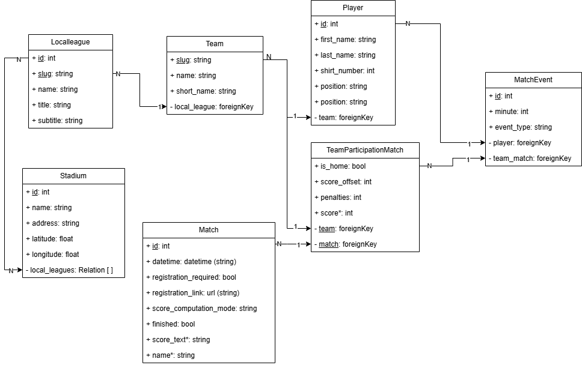

<!-- filepath: c:\Users\marco\Documents\webdev\django\backend_django\readme.md -->
<!-- ...existing code... -->
**Last edited:** 2025-11-05 — minor updates to API & Models Reference.

# API & Models Reference

This document describes the Django models, their attributes and relations, and the main REST endpoints exposed by the ViewSets (matches app).



---

## API Endpoints (exposed ViewSets)

- LocalLeagueViewSet — lookup_field: `slug`  
  - GET  /localleagues/ — list  
  - POST /localleagues/ — create  
  - GET  /localleagues/{slug}/ — retrieve  
  - PUT/PATCH /localleagues/{slug}/ — update  
  - DELETE /localleagues/{slug}/ — delete

- TeamViewSet — lookup_field: `slug`  
  - GET  /teams/  
  - POST /teams/  
  - GET/PUT/PATCH/DELETE /teams/{slug}/

- PlayerViewSet — default PK lookup  
  - GET  /players/  
  - POST /players/  
  - GET/PUT/PATCH/DELETE /players/{pk}/

- StadiumViewSet — default PK lookup  
  - GET  /stadiums/  
  - POST /stadiums/  
  - GET/PUT/PATCH/DELETE /stadiums/{pk}/

- MatchViewSet — default PK lookup  
  - GET  /matches/  
  - POST /matches/  
  - GET/PUT/PATCH/DELETE /matches/{pk}/  
  - Note: MatchSerializer returns nested participations (TeamParticipationMatchSerializer) as `teams` (read-only)

- MatchEventViewSet — default PK lookup  
  - GET  /matchevents/  
  - POST /matchevents/  
  - GET/PUT/PATCH/DELETE /matchevents/{pk}/

Note: There is no public ViewSet registered for TeamParticipationMatch in the attached views — participations are serialized nested under Match and created/managed either via a dedicated endpoint (not present) or by adding a ViewSet for TeamParticipationMatch.

---

## Models

All tables list the model attributes (name, type, notes) and a short relations section.

### LocalLeague

| Attribute | Type | Notes |
|---|---:|---|
| id | AutoField (PK) | implicit primary key |
| slug | SlugField(max_length=20) | unique=True, null=False — used as API lookup |
| name | CharField(max_length=50) | required |
| title | CharField(max_length=100) | required |
| subtitle | CharField(max_length=200) | blank=True (optional) |

Relations:
- teams — One-to-Many from Team (Team.local_league, related_name='teams')
- stadiums — ManyToMany to Stadium (Stadium.local_leagues, related_name='stadiums')

---

### Team

| Attribute | Type | Notes |
|---|---:|---|
| id | AutoField (PK) | implicit |
| slug | SlugField(max_length=20) | unique=True, null=False — used as API lookup and in SlugRelatedFields |
| name | CharField(max_length=50) | required |
| short_name | CharField(max_length=20) | required |
| local_league | ForeignKey(LocalLeague) | on_delete=PROTECT, related_name='teams' |

Relations:
- local_league -> LocalLeague (FK)
- players — One-to-Many from Player (Player.team, related_name='players')
- matches — ManyToMany with Match via TeamParticipationMatch (related_name='matches')

---

### Player

| Attribute | Type | Notes |
|---|---:|---|
| id | AutoField (PK) | implicit |
| first_name | CharField(max_length=30) | required |
| last_name | CharField(max_length=30) | required |
| shirt_number | PositiveSmallIntegerField | validators: Min 1, Max 99 |
| position | CharField(max_length=5) | choices: POR, DIF, CEN, ATT; null=True, blank=True |
| team | ForeignKey(Team) | on_delete=CASCADE, related_name='players' |

Relations:
- team -> Team (FK)
- match_events — One-to-Many from MatchEvent (MatchEvent.player, related_name='match_events')

---

### Stadium

| Attribute | Type | Notes |
|---|---:|---|
| id | AutoField (PK) | implicit |
| name | CharField(max_length=100) | required |
| address | CharField(max_length=100) | required |
| latitude | DecimalField(max_digits=9, decimal_places=6) | null=True, blank=True (optional) |
| longitude | DecimalField(max_digits=9, decimal_places=6) | null=True, blank=True (optional) |
| local_leagues | ManyToManyField(LocalLeague) | related_name='stadiums' — leagues using this stadium |

Relations:
- matches — One-to-Many from Match (Match.stadium, related_name='matches')
- local_leagues — M2M to LocalLeague

---

### TeamParticipationMatch (through model)

| Attribute | Type | Notes |
|---|---:|---|
| id | AutoField (PK) | implicit |
| team | ForeignKey(Team) | on_delete=PROTECT, related_name='match_participations' |
| match | ForeignKey(Match) | on_delete=CASCADE, related_name='participations' |
| is_home | BooleanField | default=False — indicates home/away |
| score_offset | SmallIntegerField | default=0 — can be negative; adjusts displayed score |
| penalties | PositiveSmallIntegerField | default=0 |

Other:
- `score` — computed property (cached_property) that returns the computed score for this team based on match events, offsets and the match's score computation mode (read-only, shown by TeamParticipationMatchSerializer).
- Meta constraints (present in model): unique constraint on (team, match) and unique on (match, is_home) to ensure single participation per team/match and a maximum of two teams per match.

Relations:
- team -> Team
- match -> Match
- events — One-to-Many from MatchEvent (MatchEvent.team_match, related_name='events')

---

### Match

| Attribute | Type | Notes |
|---|---:|---|
| id | AutoField (PK) | implicit |
| datetime | DateTimeField | required — match date/time |
| teams | ManyToManyField(Team) through=TeamParticipationMatch | related_name='matches' — use TeamParticipationMatch for details |
| stadium | ForeignKey(Stadium) | on_delete=SET_NULL, null=True, blank=True, related_name='matches' |
| registration_required | BooleanField | default=False |
| registration_link | URLField(max_length=200) | blank=True, null=True |
| score_computation_mode | CharField(max_length=10) | choices: 'EVENTS', 'OFFSET', 'SUM'; default='EVENTS' |
| finished | BooleanField | default=False |

Computed / properties (read-only, used in serializer):
- `score_text` — human-readable "home_score - away_score" (or "N/A" if participations ≠ 2)
- `name` — derived string like "Home Team vs Away Team" built from participations

Meta:
- verbose_name_plural = "Matches"
- ordering = ['-datetime']

Relations:
- participations -> TeamParticipationMatch (related_name='participations')
- stadium -> Stadium (FK)
- teams -> Team (M2M through TeamParticipationMatch)

---

### MatchEvent

| Attribute | Type | Notes |
|---|---:|---|
| id | AutoField (PK) | implicit |
| team_match | ForeignKey(TeamParticipationMatch) | on_delete=CASCADE, related_name='events' — identifies match+team |
| minute | PositiveSmallIntegerField | validators: Min 0, Max 120; null=True, blank=True |
| player | ForeignKey(Player) | on_delete=SET_NULL, related_name='match_events', null=True, blank=True |
| event_type | CharField(max_length=15) | choices: e.g. 'GOAL', 'YELLOW_CARD', 'RED_CARD'; default='GOAL' |

Relations:
- team_match -> TeamParticipationMatch
- player -> Player

---

## Serializers — key behaviors

- LocalLeagueSerializer
  - fields='__all__'
  - Meta.extra_fields = ['teams', 'stadiums'] — ExtraFieldsSerializer expands fields when used
  - depth = 1

- TeamSerializer
  - `local_league` is a SlugRelatedField using LocalLeague.slug (accepts slug on create/update)
  - Meta.extra_fields = ['players'] — extra nested players when requested
  - depth = 1

- TeamSerializerNoplayers
  - Same as TeamSerializer but without extra nested players (used inside participations)

- PlayerSerializer
  - `team` is a SlugRelatedField using Team.slug (accepts slug when creating/updating)

- StadiumSerializer
  - `local_leagues` is a SlugRelatedField(many=True) using LocalLeague.slug (accepts list of slugs)

- MatchEventSerializer
  - `team_match` and `player` use PrimaryKeyRelatedField (use PKs to reference)

- TeamParticipationMatchSerializer
  - `team` nested using TeamSerializerNoplayers (read_only)
  - `events` nested MatchEventSerializer (read_only)
  - exposes fields: ['id', 'is_home', 'penalties', 'score', 'team', 'events']
  - `score` is computed/read-only

- MatchSerializer
  - `teams` populated from `participations` (source='participations') using TeamParticipationMatchSerializer (read_only)
  - fields: ['id', 'datetime', 'stadium', 'score_text', 'name', 'finished', 'teams']
  - participations are read-only via MatchSerializer — create/edit participations through TeamParticipationMatch (no ViewSet provided by default)

---

## API behavior highlights / usage notes

- Team and Player endpoints accept `team` / `local_league` as slugs (SlugRelatedField). Example creating a player: { "first_name": "...", "last_name": "...", "shirt_number": 10, "team": "team-slug" }.
- Stadiums accept `local_leagues` as a list of slugs.
- MatchEvent creation expects `team_match` (TeamParticipationMatch PK) and `player` (Player PK).
- Match score behavior:
  - `score_computation_mode = 'EVENTS'` — counts GOAL MatchEvent entries for each TeamParticipationMatch to compute score.
  - `'OFFSET'` — uses TeamParticipationMatch.score_offset only.
  - `'SUM'` — events + offset.
- To create participations for a match you must create TeamParticipationMatch records (no public ViewSet present in views.py). Consider adding a TeamParticipationMatch ViewSet to allow API management of participations.

---

### JSON responses (boilerplate placeholders)

Below are minimal boilerplate JSON responses for the endpoints that have public ViewSets. Replace the placeholder values with the actual API responses.

- LocalLeague (lookup_field: slug)
  - GET /localleagues/ (list)
  ```json
  [
    {
        "id": 1,
        "slug": "molecup",
        "name": "Mole Cup",
        "title": "Mole Cup Reale Mutua",
        "subtitle": "",
        "teams": [
            {
                "id": 1,
                "slug": "alfieri",
                "name": "Alfieri",
                "short_name": "ALF",
                "local_league": 1
            },
            {
                "id": 2,
                "slug": "galfer",
                "name": "Galfer",
                "short_name": "GAL",
                "local_league": 1
            },
            {
                "id": 3,
                "slug": "gioberti",
                "name": "Gioberti",
                "short_name": "GIO",
                "local_league": 1
            }
        ],
        "stadiums": [
            {
                "id": 1,
                "name": "Cus Torino",
                "address": "Via Milano, 63, 10095 Grugliasco TO",
                "latitude": "45.020000",
                "longitude": "7.100000",
                "local_leagues": [
                    1
                ]
            }
        ]
    },
    ...
  ]
  ```

- Team (lookup_field: slug)
  - GET /teams/ (list)
  ```json
  [
    {
        "id": 1,
        "local_league": "molecup",
        "slug": "alfieri",
        "name": "Alfieri",
        "short_name": "ALF",
        "players": [
            {
                "id": 1,
                "first_name": "Pippo",
                "last_name": "Rossi",
                "shirt_number": 12,
                "position": "ATT",
                "team": 1
            }
        ]
    },
    ...
  ]
  ```

- Player (PK lookup)
  - GET /players/ (list)
  ```json
  [
    {
        "id": 1,
        "team": "alfieri",
        "first_name": "Pippo",
        "last_name": "Rossi",
        "shirt_number": 12,
        "position": "ATT"
    },
    ...
  ]
  ```

- Stadium (PK lookup)
  - GET /stadiums/ (list)
  ```json
  [
    {
        "id": 1,
        "local_leagues": [
            "molecup"
        ],
        "name": "Cus Torino",
        "address": "Via Milano, 63, 10095 Grugliasco TO",
        "latitude": "45.020000",
        "longitude": "7.100000"
    },
    ...
  ]
  ```


- Match (PK lookup)
  - GET /matches/ (list)
  ```json
  [
    [
    {
        "id": 4,
        "datetime": "2025-10-28T18:05:58Z",
        "stadium": {
            "id": 1,
            "name": "Cus Torino",
            "address": "Via Milano, 63, 10095 Grugliasco TO",
            "latitude": "45.020000",
            "longitude": "7.100000",
            "local_leagues": [
                1
            ]
        },
        "score_text": "1 - 0",
        "name": "Galfer vs Gioberti",
        "finished": false,
        "teams": [
            {
                "id": 7,
                "is_home": true,
                "penalties": 0,
                "score": 1,
                "team": {
                    "id": 2,
                    "local_league": "molecup",
                    "slug": "galfer",
                    "name": "Galfer",
                    "short_name": "GAL"
                },
                "events": [
                    {
                        "id": 2,
                        "team_match": 7,
                        "player": null,
                        "minute": 4,
                        "event_type": "GOAL"
                    },
                    {
                        "id": 3,
                        "team_match": 7,
                        "player": null,
                        "minute": 4,
                        "event_type": "YELLOW_CARD"
                    }
                ]
            },
            {
                "id": 8,
                "is_home": false,
                "penalties": 0,
                "score": 0,
                "team": {
                    "id": 3,
                    "local_league": "molecup",
                    "slug": "gioberti",
                    "name": "Gioberti",
                    "short_name": "GIO"
                },
                "events": []
            }
        ]
    },
    ...
  ]
  ```

- MatchEvent (PK lookup)
  - GET /matchevents/ (list)
  ```json
  [
    {
        "id": 2,
        "team_match": 7,
        "player": null,
        "minute": 4,
        "event_type": "GOAL"
    },
    ...
  ]
  ```

<!-- ...existing code... -->